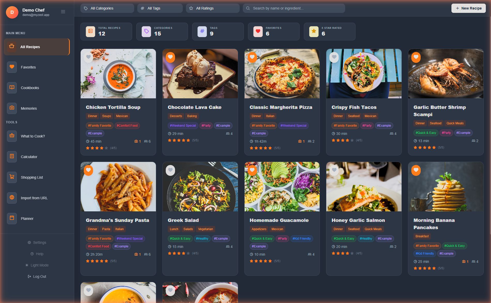

h<p align="center">
  
</p>

<h1 align="center">Zest</h1>

<p align="center">
  <strong>The lightest self-hosted recipe manager that actually cares about your food memories.</strong>
</p>

<p align="center">
  <a href="#-quickstart"></a>
  
  
  
</p>

<p align="center">
  <em>Other recipe apps store recipes. Zest stores the moments around the table.</em>
</p>

<p align="center">
    <a href="https://myzest.app"><strong>Try Zest live &rarr;</strong>strong></a>a>
  &nbsp;&middot;&nbsp;
  <a href="https://myzest.app">Website</a>
  &nbsp;&middot;&nbsp;
  <a href="https://myzest.app/manual.html">Documentation</a>
</p>

---

<p align="center">
  
</p>

<p align="center">
  
</p>
---

## Why Zest?

Every recipe manager out there treats food like data: title, ingredients, steps, done. But cooking is more than that. It's the Sunday your daughter helped you make pasta for the first time. The improvised dinner that became a family legend. The photo your partner took while you weren't looking.

**Zest is a culinary diary** — recipes + memories + beautiful shareable cards, all running on your own hardware in a single container. No cloud, no subscriptions, no telemetry. Just your food story, owned by you.

### What makes it different

- **Memories** — Attach photos, dates, locations, and stories to any recipe. Build a timeline of your cooking life.
- **Moment Cards** — Generate gorgeous shareable images (Instagram Stories, square, landscape) from your memories with one click.
- **Cookbooks** — Curate collections and share them via public links or export as beautiful PDFs.
- **"What to Cook?"** — Tell Zest what ingredients you have, it tells you what you can make.
- **4-Tier Recipe Scraper** — Paste any URL. Zest tries recipe-scrapers, JSON-LD, Microdata, then HTML heuristics. It *will* find the recipe.
- **Stupid simple to run** — One `docker compose up`. SQLite. No Postgres, no Redis, no external services.

---

## Features at a glance

| | Feature | Description |
|---|---|---|
| 🍳 | **Full Recipe CRUD** | Create, edit, search, filter, rate, favorite. Categories and color-coded tags. |
| 🌐 | **URL Import** | Paste a link from any cooking site. 4-tier scraping handles even the worst recipe blogs. |
| 📸 | **Memories** | Photo diary entries linked to recipes. EXIF support, GPS metadata, multi-photo upload. |
| 🎴 | **Moment Cards** | Auto-generated social cards (1080×1080, 1080×1920, 1200×630) from your memories. |
| 📚 | **Cookbooks** | Curated collections with custom covers. Share via link or export as PDF. |
| 🔗 | **Sharing** | Public links for cookbooks. Recipients don't need an account. |
| 🛒 | **Shopping List** | Add ingredients from any recipe, scaled to your portions. Combine multiple recipes. |
| ⚖️ | **Portion Calculator** | Scale any recipe from 1 to 100 servings. Fractions displayed beautifully (½, ¼, ⅓). |
| 👨‍🍳 | **Cooking Mode** | Full-screen step-by-step with auto-detected timers, Wake Lock, and ingredient panel. |
| 🔍 | **"What to Cook?"** | Enter available ingredients → get ranked recipe suggestions with missing item counts. |
| 📄 | **PDF Export** | Professional cookbook PDFs with cover page, recipe cards, and proper typography. |
| 💾 | **Automatic Backups** | Scheduled database + image backups. Manual export/import. Full disaster recovery. |
| 🌙 | **Dark Mode** | Full dark theme. Respects your preference. |
| 📱 | **Mobile Friendly** | Optimized for desktop with mobile support in progress. |
| 🔒 | **Auth + Rate Limiting** | JWT auth, bcrypt passwords, rate-limited endpoints. |
| 🍎 | **iPhone Photos** | HEIC/HEIF support out of the box. |

---

## Quickstart

```bash
git clone https://github.com/MartinSantosT/myzest.git
cd myzest
cp .env.example .env
docker compose up -d
```

Open **http://localhost:8000** and that's it. First-time setup takes about 30 seconds.

**First launch:** Register your account — the first user becomes admin and gets 12 example recipes with photos to explore.

### Generate a secure secret key

```bash
python -c "import secrets; print(secrets.token_urlsafe(32))"
```

Paste the result in your `.env` file:

```env
ZEST_SECRET_KEY=your-generated-secret-here
```

---

## Architecture

```
zest/
├── app/
│   ├── main.py              # FastAPI application (all endpoints)
│   ├── models.py             # SQLAlchemy models
│   ├── schemas.py            # Pydantic schemas
│   ├── database.py           # Database connection
│   ├── scrapers.py           # 4-tier recipe scraping engine
│   ├── card_generator.py     # Pillow-based moment card generator
│   └── static/
│       ├── index.html        # SPA frontend
│       ├── shared.html       # Public cookbook viewer
│       └── js/               # 26 ES modules
│           ├── app.js        # Module orchestrator
│           ├── api.js         # API client
│           ├── recipes.js    # Recipe management
│           ├── memories.js   # Culinary diary
│           ├── cookbooks.js  # Collections
│           ├── shoppingList.js
│           ├── calculator.js
│           ├── whatToCook.js
│           └── ...           # 18 more modules
├── tests/                    # pytest test suite
├── data/                     # SQLite database + backups (volume-mounted)
├── Dockerfile
├── docker-compose.yml
├── requirements.txt
└── .env.example
```

**Stack:** FastAPI · SQLAlchemy · SQLite · Pillow · ReportLab · Vanilla JS (ES Modules) · Tailwind CSS

No frontend build step. No webpack. No node_modules. The frontend is a single HTML file with 26 ES modules loaded natively by the browser.

---

## Configuration

All configuration is done through environment variables in `.env`:

| Variable | Default | Description |
|---|---|---|
| `ZEST_SECRET_KEY` | `zest-change-this-secret-in-production` | JWT signing key. **Change this.** |

### Volumes

| Path | Purpose |
|---|---|
| `./data:/app/data` | Database, backups, exports |
| `./app:/app/app` | Application code (enables hot reload in dev) |

### Ports

Default port is `8000`. Change it in `docker-compose.yml`:

```yaml
ports:
  - "3000:8000"  # Access on port 3000
```

---

## Updating

```bash
cd myzest
git pull
docker compose build
docker compose down && docker compose up -d
```

Zest handles database migrations automatically on startup.

---

## Backups

Zest includes a built-in backup system accessible from **Settings → Backups**:

- **Automatic backups** — Configure frequency (12h / 24h / 7 days) and retention count
- **Manual backups** — One-click database + images export as `.zip`
- **Import/Export** — Move your data between instances or restore from backup
- **JSON export** — Export recipes as portable JSON for interoperability

Backups are stored in `./data/backups/` on the host.

---

## Running tests

```bash
docker exec zest_backend pytest tests/ -v
```

---

## Reverse proxy (optional)

Example Nginx config for exposing Zest with HTTPS:

```nginx
server {
    listen 443 ssl http2;
    server_name zest.example.com;  # e.g. myzest.app

    ssl_certificate     /path/to/cert.pem;
    ssl_certificate_key /path/to/key.pem;

    client_max_body_size 20M;

    location / {
        proxy_pass http://127.0.0.1:8000;
        proxy_set_header Host $host;
        proxy_set_header X-Real-IP $remote_addr;
        proxy_set_header X-Forwarded-For $proxy_add_x_forwarded_for;
        proxy_set_header X-Forwarded-Proto $scheme;
    }
}
```

Works great behind **Caddy**, **Traefik**, or **Nginx Proxy Manager** too.

---

## Health check

```bash
curl http://localhost:8000/api/health
# {"status": "healthy", "recipes": 42, "users": 1}
```

Perfect for **Uptime Kuma**, **Healthchecks.io**, or any monitoring tool.

---

## Tech details for the curious

- **Recipe scraping** uses a 4-tier fallback: `recipe-scrapers` library (400+ sites) → JSON-LD structured data → Microdata attributes → CSS heuristic selectors. If a recipe exists on the page, Zest will find it.
- **Moment Cards** are generated server-side with Pillow. No external APIs, no Canvas tricks. Pure Python image generation with gradient overlays, typography, and branding.
- **PDF export** uses ReportLab with DejaVu fonts (bundled in the Docker image) for proper Unicode support.
- **Auth** uses bcrypt with automatic legacy hash migration. Rate limiting via slowapi on sensitive endpoints.
- **Frontend** is a true SPA built with vanilla JavaScript ES modules. Zero dependencies. Zero build tools. Fast.
- **Image processing** automatically resizes uploads to max 1920px, converts HEIC to JPEG, and preserves EXIF metadata.

---

## Roadmap

- [x] Cooking mode (full-screen step-by-step with auto-detected timers and Wake Lock)
- [ ] Meal planner with drag-and-drop weekly view
- [ ] Multi-user family accounts
- [ ] PWA with offline support
- [ ] AI recipe import from video (Whisper + LLM)

Want to help? Open an issue or submit a PR.

---

## Compared to alternatives

| | Zest | Mealie | Tandoor | Paprika |
|---|---|---|---|---|
| Docker single container | ✅ | ❌ (needs Postgres) | ❌ (needs Postgres) | ❌ (not self-hosted) |
| Memories / food diary | ✅ | ❌ | ❌ | ❌ |
| Shareable moment cards | ✅ | ❌ | ❌ | ❌ |
| Cooking mode (timers + Wake Lock) | ✅ | ❌ | ❌ | ❌ |
| Cookbook PDF export | ✅ | ✅ | ✅ | ✅ |
| URL recipe scraping | ✅ (4-tier) | ✅ | ✅ | ✅ |
| Shopping list | ✅ | ✅ | ✅ | ✅ |
| Portion calculator | ✅ | ✅ | ✅ | ✅ |
| "What to cook?" search | ✅ | ❌ | ❌ | ❌ |
| HEIC/iPhone support | ✅ | ❌ | ❌ | ❌ |
| No external database | ✅ (SQLite) | ❌ | ❌ | — |
| Auto backups | ✅ | ✅ | ✅ | ❌ |
| Zero build tools | ✅ | ❌ | ❌ | — |

---

## License

MIT — do whatever you want with it.

---

<p align="center">
  <strong>🍊 Zest</strong> — Because recipes deserve memories.
</p>
